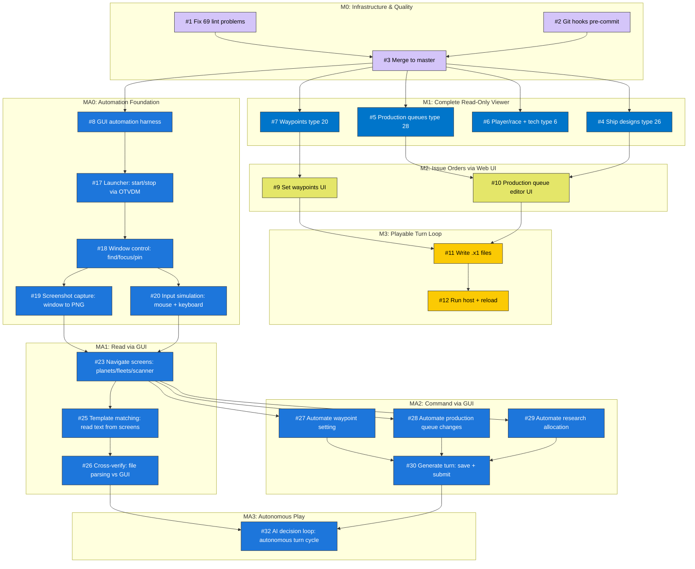

# Stars! Web — Issue Dependency Graph

This diagram shows the dependency flow between GitHub issues.
Arrows mean "must be done before." Colors match issue labels.

GitHub renders Mermaid natively — view this file on github.com to see the graph.

## Critical Paths

### Web track (shortest path to playable game)

**#1 + #2 → #3 → #7 → #9 → #11 → #12**

(lint → hooks → merge → waypoints → set waypoints UI → write .x1 → run host)

### Automation track (shortest path to autonomous play)

**#3 → #8 → #17 → #18 → #20 → #23 → #27 → #30 → #32**

(merge → harness → launcher → window → input → navigate → waypoints → generate turn → AI loop)

Production queues (#5 → #10) and GUI reading (#19 → #25 → #26) can be done in parallel on their respective tracks.

## How to Update

When adding new issues, update this diagram:

1. Add the issue node in the appropriate milestone subgraph
2. Add dependency arrows
3. Assign the correct class for coloring
