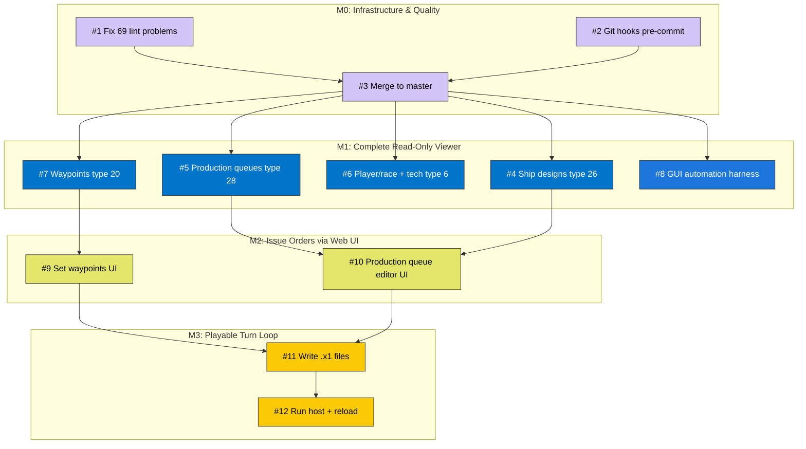

# Stars! Web — Issue Dependency Graph

This diagram shows the dependency flow between GitHub issues.
Arrows mean "must be done before." Colors match issue labels.

GitHub renders Mermaid natively — view this file on github.com to see the graph.

## Critical Path

The shortest path to a playable game:

**#1 + #2 → #3 → #7 → #9 → #11 → #12**

(lint → hooks → merge → waypoints → set waypoints UI → write .x1 → run host)

Production queues (#5 → #10) can be done in parallel once #3 is merged.

## How to Update

When adding new issues, update this diagram:

1. Add the issue node in the appropriate milestone subgraph
2. Add dependency arrows
3. Assign the correct class for coloring
